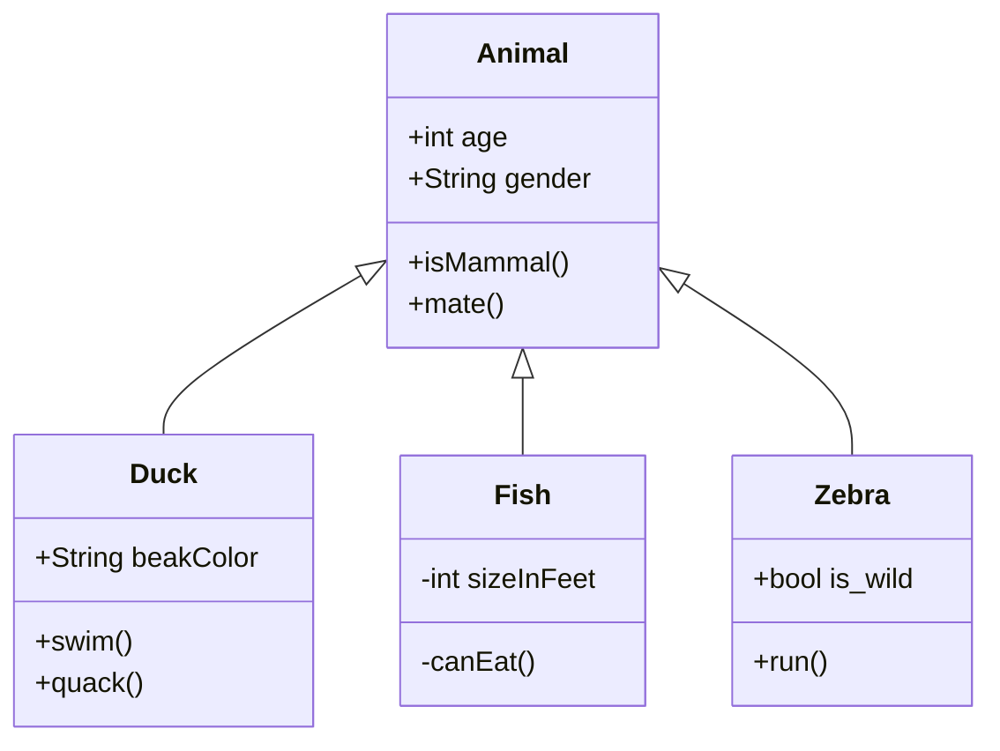

# Markdown基础语法

## 字体

* 标题
	* 使用底线（-/=）的语法

>>> 1）底线是=表示一级标题。  
2）底线是-表示二级标题。  
3）底线符号的数量至少2个。  
4）这种语法只支持这两级标题。

	* 使用＃的语法

>>> 1）在行首插入#可标记出标题。  
2）#的个数表示了标题的等级。  
3）建议在#后加一个空格。  
4）Markdown中最多只支持前六级标题。

```
一级标题
==

二级标题
--

# 一级标题
## 二级标题
### 三级标题
#### 四级标题
```

一级标题
==

二级标题
--

# 一级标题
## 二级标题
### 三级标题
#### 四级标题

* 粗体/斜体

> 粗体使用2个*/_包裹，斜体使用1个*/_包裹

```
**粗体** 或 __粗体__
*斜体* 或 _斜体_
```

**粗体**   _斜体_

## 段落与换行

> 1）如果行与行之间没有空行，则会被视为同一段落。  
2）如果行与行之间有空行，则会被视为不同的段落。  
3）空行是指行内什么都没有，或者只有空格和制表符。  
4）如果想在段内换行，则需要在上一行的结尾插入两个以上的空格然后按回车键。

## 列表
* 有序列表  
  > 数字序号 + 英文句号 + 空格 + 列表内容
* 无序列表  
  > -/\*/+ + 空格 + 列表内容
* 嵌套列表  
  > TAB + 层  
1）列表中可以嵌套列表。  
2）有序列表和无序列表也可以互相嵌套。


`背景文字`<br>


[mermaid](https://mermaid-js.github.io/mermaid)

